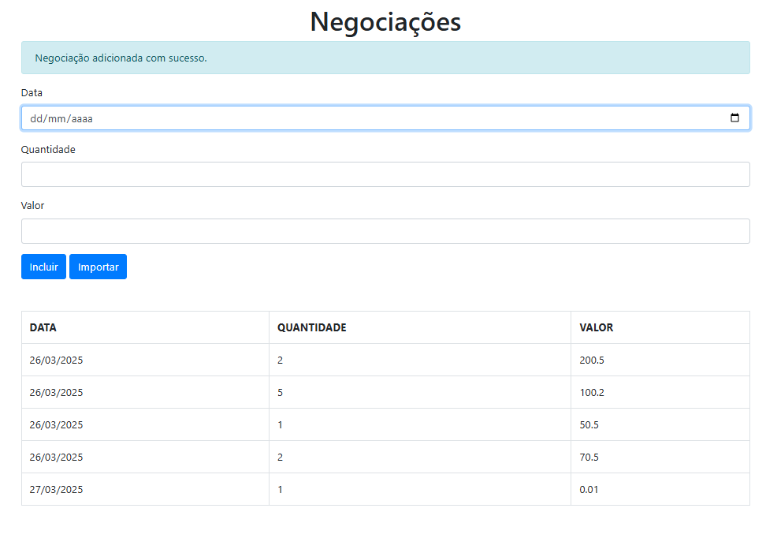

# Negociaçõoes

## ℹ️ Sobre

Projeto utilizado no curso para aprendizado das técnicas e melhores práticas.

## 📘Ementa

### TypeScript Part 1: Evolving Your JavaScript

- Aprender a configurar do zero seu ambiente
- Conhecer gradativamente os recursos do compilador do TypeScript
- Compreender as vantagens da tipagem estática
- Modelar classes utilizando o que há de melhor na linguagem
- Aprender a utilizar tipos, modificadores e outros recursos

### TypeScript parte 2: avançando na linguagem

- Aprender a utilizar modificadores de acesso, herança e tipos genéricos
- Entender o papel das Enumerations
- Criar um mini framework de atualização de view inspirado no JSX
- Configurar ainda mais seu compilador TS e tire máximo proveito do seu código

### Typescript parte 3: mais técnicas e boas práticas

- Conheer as vantagens do uso de Decorators
- Criar diferentes tipos de decorators e deixe seu código ainda mais elegante
- Compreender os benefícios do uso de interfaces
- Aprender a organizar e a adicionar tipo em seu código ao consumir uma API REST
- Entender o papel de sourceMaps e aprenda como debugar a sua aplicação no navegador
- Criar soluções combinando tudo o que aprendeu nos módulos anteriores
- Tirar benefício do Polimorfismo garantindo um código protegido e dinâmico

## 🖥️ Tecnologias

  
  
  

## 🧑‍🏫 Instrutor(es)

| [ Flavio Henrique de Souza Almeida](https://www.linkedin.com/in/fl%C3%A1vio-henrique-almeida-a6315747/) |
| :-------------------------------------------------------------------------------------------------------------------------------------------------------------------------------------------------------------------------------------------------------------------------------------------------------------------------------------------: |

## 💻 Screenshot

